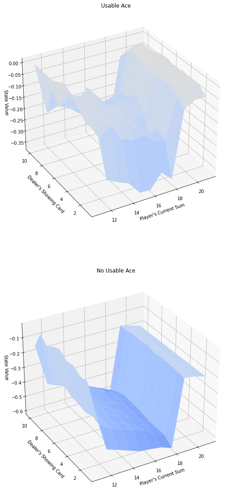

# DRL-ND-Gym-BlackJack-

## Description

In this repo I use the Monte Carlo methods to estimate the value of the different (action, states) pairs in a black jack game, given an heuristic.

## Usage

The code to estimate the Q-values of the state, action tuples in the game is located inside the jupyter notebook **Monte_Carlo.ipynb** and running all cell inside it and with the enough number of iterations you can compute the Q-values of the game.

## Installation

To use this code you need to install the following packages:

* numpy
* jupiyter
* matplotlib
* seaborn
* [OpenAI Gym](https://github.com/openai/gym#id3) 

## Results

Estimation of the action, states tuple values over the black jack game using a fix heurustic.

## License

GNU General Public License v3.0