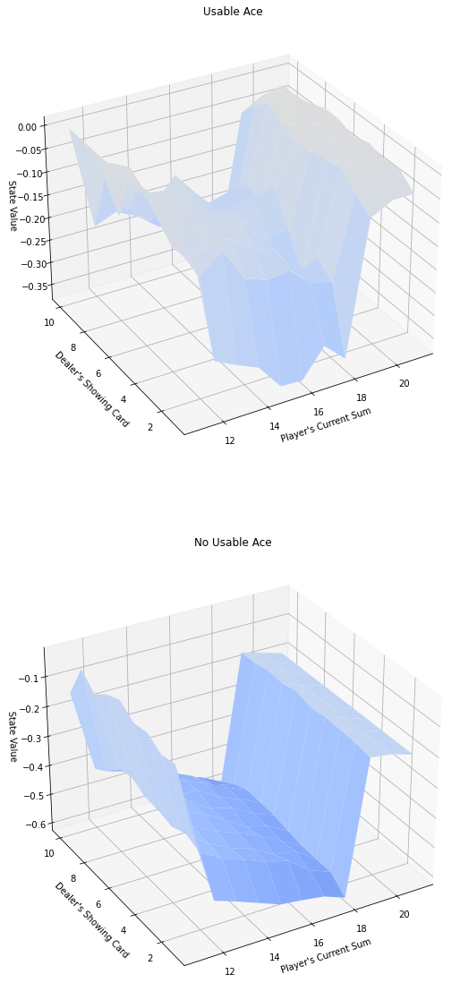

# DRL-ND-Gym-BlackJack-

<h2>Description</h2>

Q-values monte carlo estimation for openAI gym enviroment 'Blackjack-v0' using a policy in wich the agent sticks whit a probability p(STICK) if the sum is grater than 18.
 

<h2>MC Estimation results</h2>

